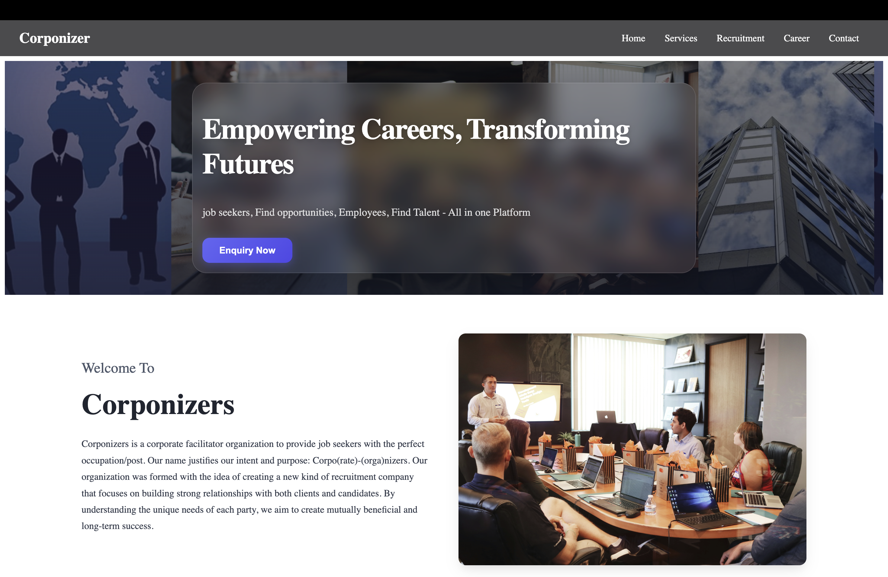
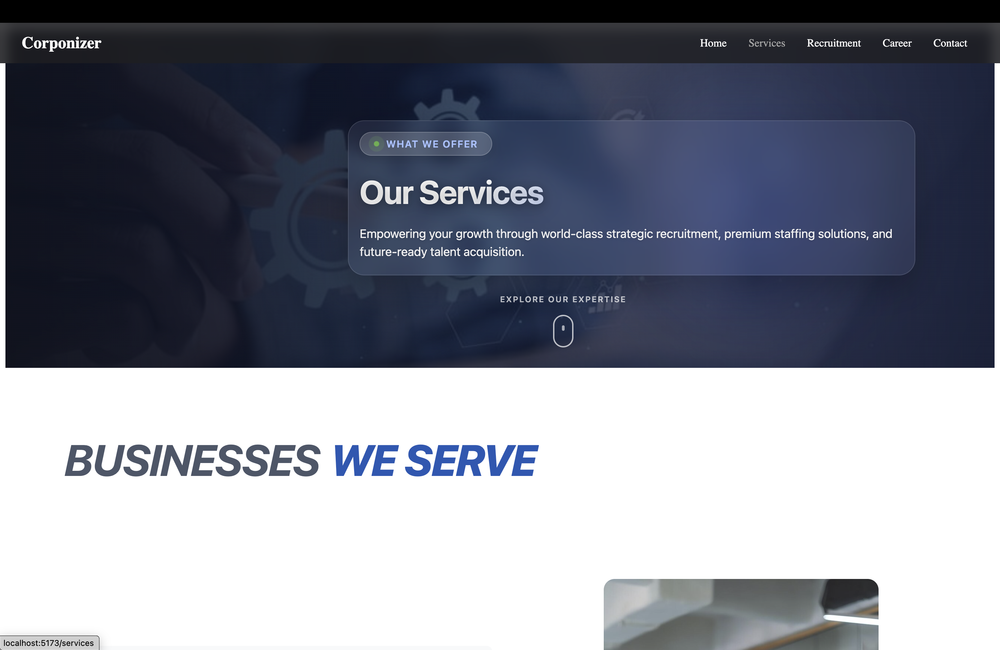
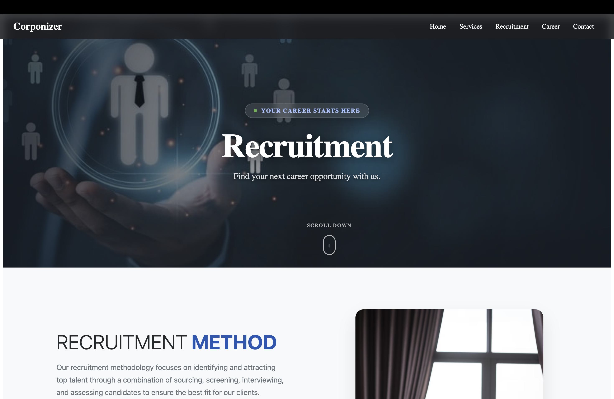
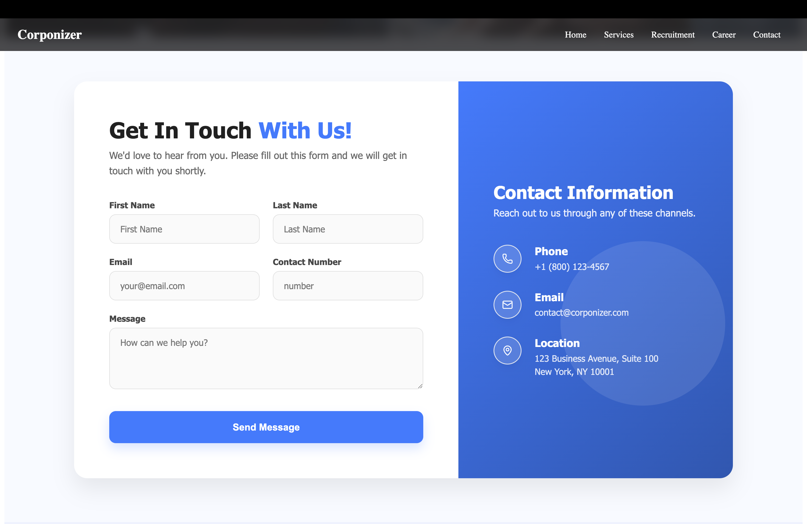
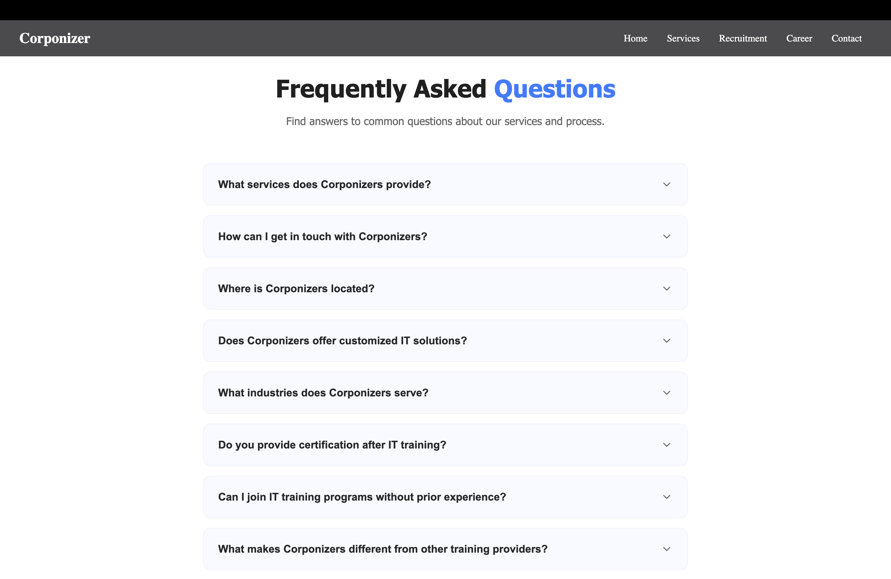

# Corponizer

A modern corporate and recruitment website built using React and Vite.

## 🚀 About The Project

Corponizer is a responsive web application designed to provide corporate services, recruitment solutions, career opportunities, and customer support through a modern and user-friendly interface.

The website includes multiple pages such as:

* Home
* Services
* Recruitment
* Career
* Contact
* FAQ
* Privacy Policy

---

## 🛠️ Built With

* React.js
* Vite
* React Router DOM
* Framer Motion
* Lucide React
* CSS

---

## 📂 Project Structure

```text
Corponizer/
│
├── public/
├── src/
│   ├── Components/
│   ├── Pages/
│   │   ├── Home.jsx
│   │   ├── Services.jsx
│   │   ├── Recruitment.jsx
│   │   ├── Career.jsx
│   │   ├── Contact.jsx
│   │   ├── Faq.jsx
│   │   └── Privacy.jsx
│   │
│   ├── App.jsx
│   └── main.jsx
│
├── package.json
├── vite.config.js
└── README.md
```

---

## ⚙️ Installation

Clone the repository:

```bash
git clone https://github.com/SNEHASISHBARIK/Corponizer.git
```

Navigate to the project folder:

```bash
cd Corponizer
```

Install dependencies:

```bash
npm install
```

Run the development server:

```bash
npm run dev
```

Open the local URL shown in your terminal, usually:

```text
http://localhost:5173
```

---

## 📸 Website Screenshots

### 🏠 Home Page

<!-- Add Home Page Screenshot Here -->



<br><br>

### 💼 Services Page

<!-- Add Services Page Screenshot Here -->



<br><br>

### 👥 Recruitment Page

<!-- Add Recruitment Page Screenshot Here -->



<br><br>

### 🎯 Career Page

<!-- Add Career Page Screenshot Here -->


<br><br>

### 📞 Contact Page

<!-- Add Contact Page Screenshot Here -->



<br><br>

### ❓ FAQ Page

<!-- Add FAQ Page Screenshot Here -->



---

## 📸 How to Add Screenshots

Create a folder named:

```text
screenshots
```

inside your project:

```text
Corponizer/
│
├── screenshots/
│   ├── home.png
│   ├── services.png
│   ├── recruitment.png
│   ├── career.png
│   ├── contact.png
│   └── faq.png
```

Then add your website screenshots to this folder.

---

## 📦 Build for Production

To create a production build:

```bash
npm run build
```

To preview the production build:

```bash
npm run preview
```

---

## 🤝 Contributing

Contributions, issues, and feature requests are welcome.

1. Fork the repository.
2. Create a new branch.
3. Make your changes.
4. Commit your changes.
5. Push the branch.
6. Create a Pull Request.

---

## 👨‍💻 Author

**Snehasish Barik**

GitHub: https://github.com/SNEHASISHBARIK

---

## 📄 License

This project is created for educational and professional purposes.

---

⭐ If you like this project, please consider giving it a star!
